# Notify Me - 使用文档

> 跨平台桌面通知与确认工具。接收 HTTP POST，弹出置顶对话框，同步返回用户决策。

---

## 目录

- [简介](#简介)
- [安装](#安装)
- [快速开始](#快速开始)
- [与 Claude Code 集成](#与-claude-code-集成)
  - [方式一：一键配置（推荐）](#方式一一键配置推荐)
  - [方式二：HTTP Hook 配置](#方式二http-hook-配置)
  - [方式三：Shell 脚本 Hook（传统）](#方式三shell-脚本-hook传统)
- [API 参考](#api-参考)
  - [端点](#端点)
  - [请求格式](#请求格式)
  - [响应说明](#响应说明)
- [主界面功能](#主界面功能)
  - [首页](#首页)
  - [通知历史](#通知历史)
  - [审核策略](#审核策略)
  - [设置](#设置)
- [系统托盘](#系统托盘)
- [配置详解](#配置详解)
- [安全说明](#安全说明)
- [常见问题](#常见问题)
- [文件位置](#文件位置)

---

## 简介

Notify Me 是一个为 AI 编程助手（如 Claude Code）设计的桌面通知工具。它解决了 AI 编程中一个关键问题：**你需要盯着终端等待确认操作**。

核心工作流程：

```
Claude Code 发起操作 → HTTP POST → Notify Me 弹出置顶窗口 → 你点击「确定/取消」→ 结果同步返回给 Claude Code
```

**核心特性：**

- 置顶弹窗通知，不会被其他窗口遮挡
- HTTP 同步阻塞 API，调用方等待用户决策后才继续
- 三种弹窗模式：确认、危险操作、信息通知
- 通知历史记录与审计
- 策略引擎：支持自动审批规则(计划中,后续实现)
- 系统托盘常驻，关闭窗口不退出
- 单实例运行，自动激活已有窗口
- 支持 macOS + Windows

<!-- 截图：整体架构示意图 -->

---

## 安装

### macOS

1. 下载 `Notify Me.app`
2. 将应用拖入「应用程序」文件夹
3. 首次打开：右键点击 → 「打开」→ 在弹出对话框中点击「打开」以绕过 Gatekeeper（因为应用未签名）

<!-- 截图：macOS Gatekeeper 绕过示意 -->

### Windows

1. 下载 `notify-me.exe`
2. 放置在任意目录（建议放在独立文件夹中）
3. 双击运行即可

### 从源码构建

需要 Go 1.25+ 和 Node.js 18+。

```bash
# 安装 Wails CLI
go install github.com/wailsapp/wails/v3/cmd/wails3@latest

# 克隆仓库
git clone https://github.com/your-org/notify-me.git
cd notify-me

# 构建前端
cd frontend && npm install && npm run build && cd ..
touch frontend/dist/.gitkeep

# 构建应用（必须在目标平台上运行）
# macOS
scripts/build.sh

# Windows
scripts/build.ps1
```

---

## 快速开始

1. **启动应用** — 双击应用图标，应用启动后会在系统托盘显示图标
2. **测试通知** — 在终端运行以下命令：

```bash
curl -d "你好，这是一条测试通知" http://127.0.0.1:1886/api/info
```

你会看到一个置顶弹窗显示消息，点击「知道了」后 curl 输出 `acknowledged`。

3. **测试确认** — 模拟 Claude Code 的确认场景：

```bash
curl -d "是否允许执行: rm -rf /tmp/test" http://127.0.0.1:1886/api/confirm
```

弹窗出现后，点击「确定」返回 `approved`，点击「取消」或关闭弹窗返回 `denied`。

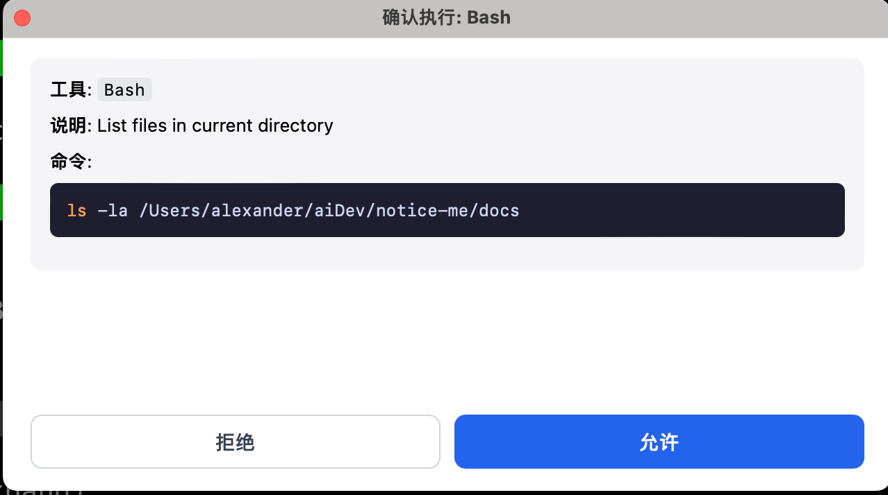

---

## 与 Claude Code 集成

Notify Me 最核心的使用场景是与 Claude Code 集成，让 Claude Code 在执行操作前弹出桌面确认窗口，而不是在终端中等待。

### 方式一：一键配置（推荐）

这是最简单的方式，Notify Me 内置了自动配置功能。

1. 启动 Notify Me，打开主窗口
2. 在「首页」标签页中，找到 **Claude Code Hook** 卡片
3. 点击「一键配置 (本机)」按钮

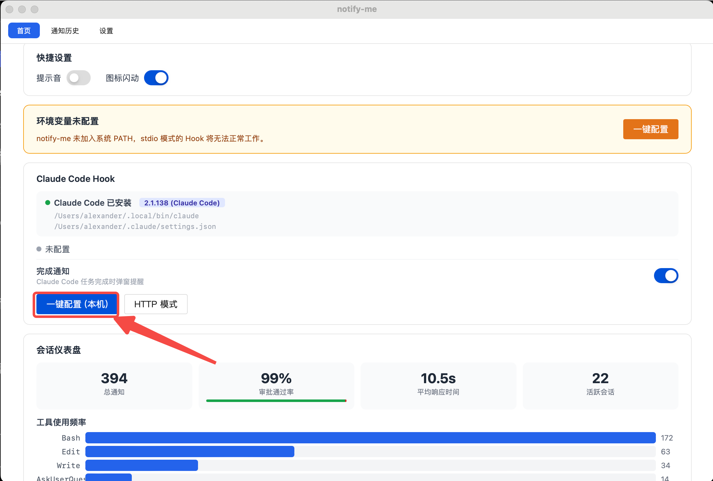

配置完成后，Hook 状态会显示为「已配置 (本机)」，下方会列出已注册的事件类型。

**工作原理：** 此方式使用 `notify-me hook` 命令作为 Shell Hook，Claude Code 触发事件时调用该命令，命令内部通过 HTTP 与 Notify Me 通信。

### 方式二：HTTP Hook 配置

如果你使用的是远程 Claude Code 实例，或者偏好 HTTP 直连模式，可以选择此方式。

1. 在首页的 Hook 配置区域，点击「HTTP 模式」按钮
2. 弹出对话框会显示 JSON 配置
3. 点击「复制」，将配置粘贴到 Claude Code 的 `settings.json` 文件中

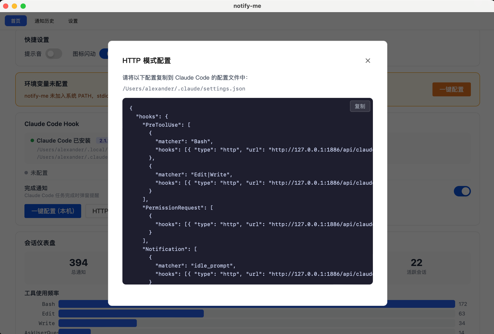

Claude Code 的 `settings.json` 位置：
- **全局：** `~/.claude/settings.json`
- **项目级：** 项目目录下 `.claude/settings.json`

完整的 HTTP Hook 配置示例：

```json
{
  "hooks": {
    "PreToolUse": [
      {
        "matcher": "Bash",
        "hooks": [{ "type": "http", "url": "http://127.0.0.1:1886/api/claude/hook", "timeout": 200 }]
      },
      {
        "matcher": "Edit|Write",
        "hooks": [{ "type": "http", "url": "http://127.0.0.1:1886/api/claude/hook", "timeout": 200 }]
      }
    ],
    "PermissionRequest": [
      {
        "hooks": [{ "type": "http", "url": "http://127.0.0.1:1886/api/claude/hook", "timeout": 200 }]
      }
    ],
    "Notification": [
      {
        "matcher": "idle_prompt",
        "hooks": [{ "type": "http", "url": "http://127.0.0.1:1886/api/claude/hook", "timeout": 10 }]
      }
    ],
    "Stop": [
      {
        "hooks": [{ "type": "http", "url": "http://127.0.0.1:1886/api/claude/hook", "timeout": 10 }]
      }
    ],
    "StopFailure": [
      {
        "hooks": [{ "type": "http", "url": "http://127.0.0.1:1886/api/claude/hook", "timeout": 10 }]
      }
    ]
  }
}
```

**Claude Code Hook 事件行为：**

| 事件 | 行为 | 弹窗类型 |
| --- | --- | --- |
| `PreToolUse` | 阻塞等待用户决策，返回 `allow`/`deny` | 确认/危险弹窗 |
| `PermissionRequest` | 阻塞等待用户决策，返回 `allow`/`deny` | 确认弹窗 |
| `PermissionDenied` | 即时返回 `retry: true` 让 Claude 重试 | 无弹窗 |
| `Notification` | 非阻塞，显示通知后立即返回 200 | 信息弹窗 |
| `Stop` | 非阻塞，显示「Claude 已完成」 | 信息弹窗 |
| `StopFailure` | 非阻塞，显示错误信息 | 信息弹窗 |

**自动危险检测：** 当 Claude Code 尝试执行 `rm -rf`、`git push --force`、`git reset --hard` 等危险命令时，Notify Me 会自动使用红色警告样式的危险弹窗。

### 方式三：Shell 脚本 Hook（传统）

适用于不支持 HTTP Hook 的旧版 Claude Code。

**macOS / Linux (bash)：**

将以下内容保存为 `.claude/hooks/preToolUse.sh`：

```bash
#!/usr/bin/env bash
set -euo pipefail
CMD="${CLAUDE_TOOL_INPUT:-(no tool input env)}"
RESULT=$(curl -s -m 200 -d "$CMD" http://127.0.0.1:1886/api/confirm || echo "denied")
case "$RESULT" in
  approved)  exit 0 ;;
  *)         echo "用户拒绝执行: $RESULT" >&2 ; exit 2 ;;
esac
```

**Windows (PowerShell)：**

将以下内容保存为 `.claude/hooks/preToolUse.ps1`：

```powershell
$cmd = $env:CLAUDE_TOOL_INPUT
if (-not $cmd) { $cmd = '(no tool input env)' }
try {
  $r = Invoke-RestMethod -Method Post -Uri http://127.0.0.1:1886/api/confirm -Body $cmd -TimeoutSec 200
} catch {
  $r = 'denied'
}
if ($r -eq 'approved') { exit 0 } else { Write-Error "用户拒绝: $r"; exit 2 }
```

> **注意：** `-m 200`（bash）/ `-TimeoutSec 200`（PowerShell）需大于服务端默认超时 180 秒。

---

## API 参考

### 端点

默认前缀 `/api`（可在配置中修改），默认端口 `1886`。

| 路径 | 模式 | 确认按钮 | 取消按钮 | 用途 |
| --- | --- | --- | --- | --- |
| `POST /api/confirm` | 双按钮 | 确定 | 取消 | 一般确认 |
| `POST /api/danger` | 双按钮 | 允许 | 拒绝 | 危险操作确认 |
| `POST /api/info` | 单按钮 | 知道了 | 无 | 信息通知 |

### 请求格式

支持三种请求格式，优先级：**JSON Body > Header > Query > 端点默认值 > 全局默认值**。

**格式一：纯文本**

最简单的调用方式，body 直接作为消息内容。

```bash
curl -d "Continue?" http://127.0.0.1:1886/api/confirm
```

**格式二：Header / Query 参数**

通过 HTTP Header 或 URL Query String 传递额外参数。

```bash
# 使用 Header
curl -d "rm -rf /tmp/foo" \
     -H "X-Title: 危险命令" \
     -H "X-Timeout: 60" \
     -H "X-Ok: 允许" \
     -H "X-Cancel: 拒绝" \
     http://127.0.0.1:1886/api/confirm

# 使用 Query
curl -d "rm -rf /tmp/foo" \
     "http://127.0.0.1:1886/api/confirm?title=危险&timeout=60&ok=允许&cancel=拒绝"
```

可识别的参数：

| 参数 | Header | Query | 说明 |
| --- | --- | --- | --- |
| 标题 | `X-Title` | `title` | 弹窗标题 |
| 超时 | `X-Timeout` | `timeout` | 超时秒数（默认 180） |
| 确认按钮 | `X-Ok` | `ok` | 确认按钮文案 |
| 取消按钮 | `X-Cancel` | `cancel` | 取消按钮文案 |

**格式三：JSON**

```bash
curl -X POST \
     -H "Content-Type: application/json" \
     -d '{
       "title": "确认执行",
       "message": "rm -rf /tmp/foo",
       "ok_text": "允许",
       "cancel_text": "拒绝",
       "timeout": 60
     }' \
     http://127.0.0.1:1886/api/confirm
```

### 响应说明

所有响应均为 HTTP 200（除非特别说明），body 为纯文本决策结果。

| 响应 Body | 含义 | HTTP 状态码 |
| --- | --- | --- |
| `approved` | 用户点击了确认按钮 | 200 |
| `denied` | 用户点击了取消按钮或关闭了弹窗 | 200 |
| `acknowledged` | 用户点击了单按钮（info 端点） | 200 |
| `timeout` | 超时未操作（默认 180 秒） | 200 |
| `paused` | 托盘菜单已暂停接收通知 | 503 |
| `queue full` | 待处理通知队列已满 | 503 |
| `not found` | 请求路径不存在 | 404 |

---

## 主界面功能

主窗口包含三个标签页：**首页**、**通知历史**、**设置**。

### 首页

首页是信息中心，包含以下模块：

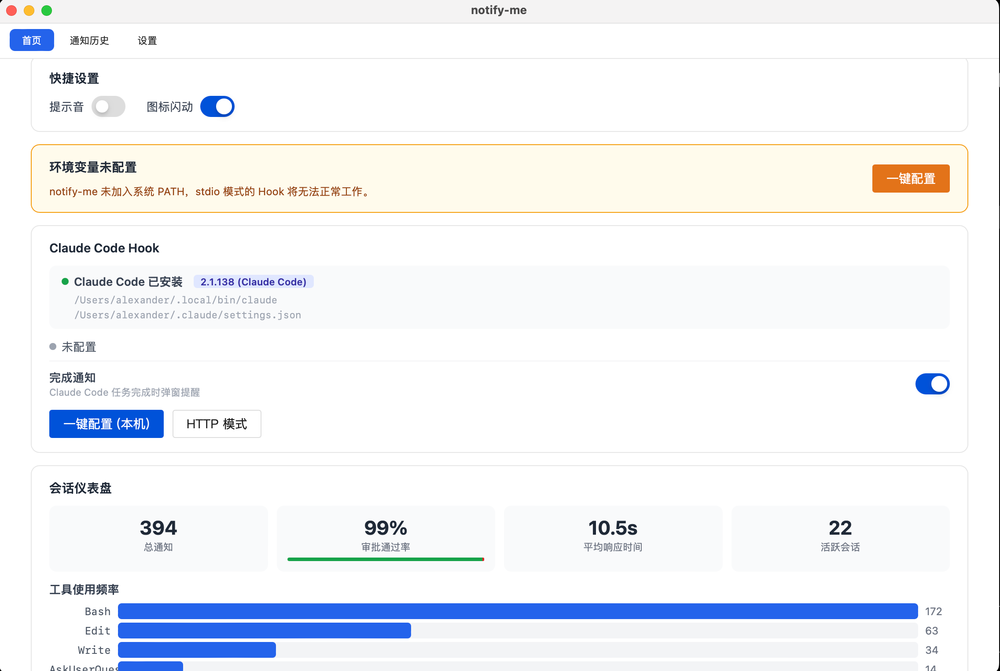

**快捷设置**

在页面顶部可以快速切换：
- **提示音** — 开关通知音效
- **图标闪动** — 开关收到通知时的图标闪烁

**Claude Code Hook 配置**

显示当前 Claude Code 的安装状态和 Hook 配置状态：
- 环境检测：自动检测 Claude Code 是否安装及其版本
- 配置状态：显示 Hook 是否已配置及配置模式
- 已注册事件：列出当前生效的 Hook 事件（工具调用、权限请求等）
- 完成通知：开关 Claude Code 任务完成时的弹窗提醒

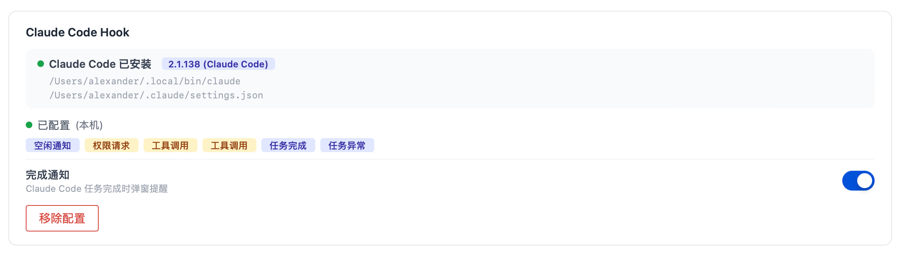

**会话仪表盘**

统计信息总览：
- 总通知数
- 审批通过率（含可视化进度条）
- 平均响应时间
- 活跃会话数

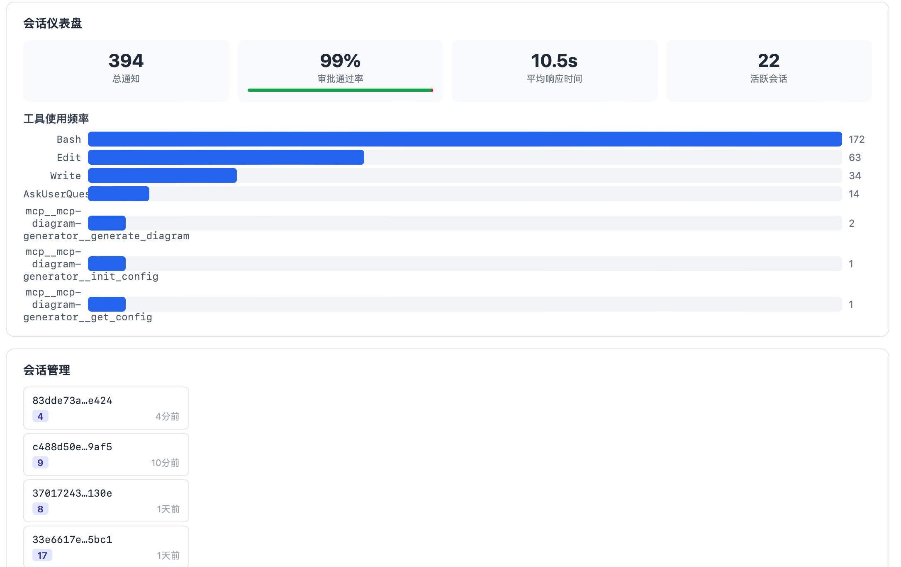

**工具使用频率**

以条形图展示各工具的调用频率。

**会话管理**

列出所有活跃会话，点击会话可查看该会话的工具调用时间线，包括每次调用的工具名、决策结果和耗时。

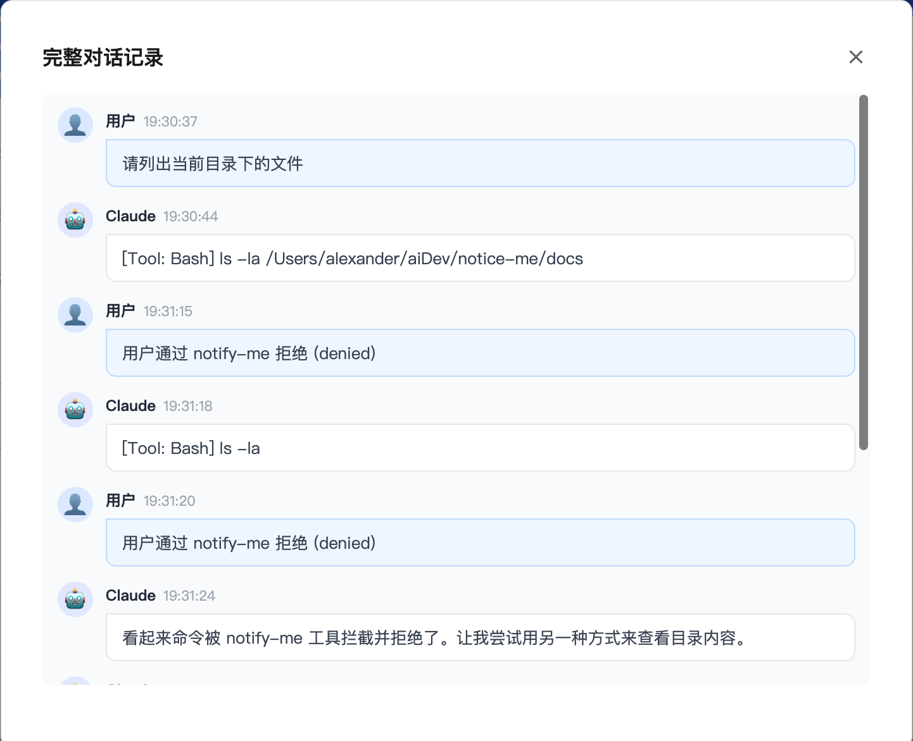

### 通知历史

通知历史页面记录所有通知的完整生命周期。

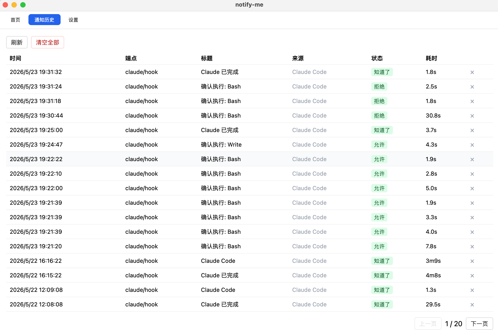

**列表视图**

表格展示所有通知记录，列包括：时间、端点、标题、来源、状态、耗时。

**详情面板**

点击任意记录，右侧弹出详情面板，显示：
- 状态、端点、标题
- 完整消息内容（支持 Markdown 渲染）
- 来源 IP 和来源头
- 创建时间和完成时间
- 耗时

对于 `pending`（等待中）的记录，可以直接在详情面板中点击「允许」或「拒绝」。

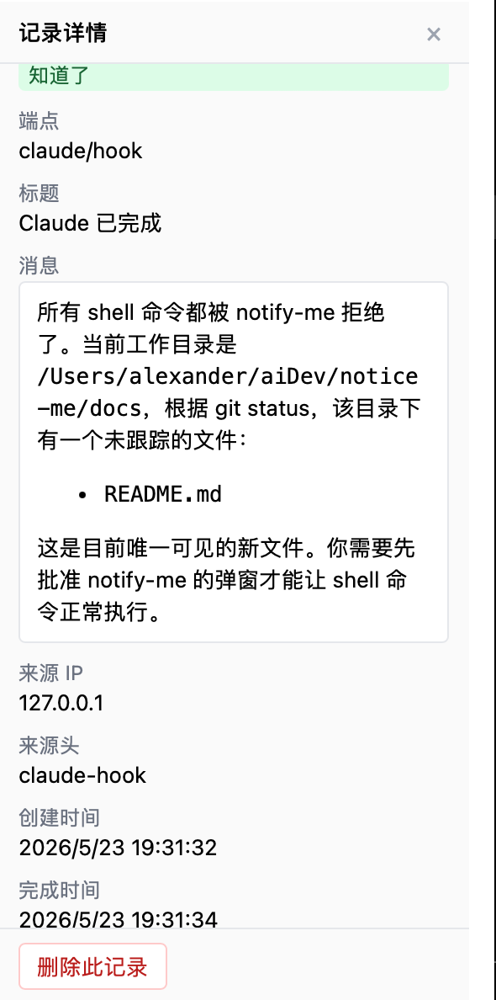

### 审核策略(计划中,后续完善)

策略引擎允许你配置自动审批规则，减少对重复操作的确认次数。

**策略引擎模板（全局规则）**

- 为特定工具名 + 命令模式创建匹配规则
- 支持正则表达式匹配命令内容
- 可调整规则优先级
- 支持启用/禁用单条规则

**会话免审批列表**

- 按会话维度自动生成的免审批规则
- 可手动清理已结束的会话规则

### 设置

设置页面提供完整的 JSON 配置编辑器，可以直接编辑 `config.json` 的内容。

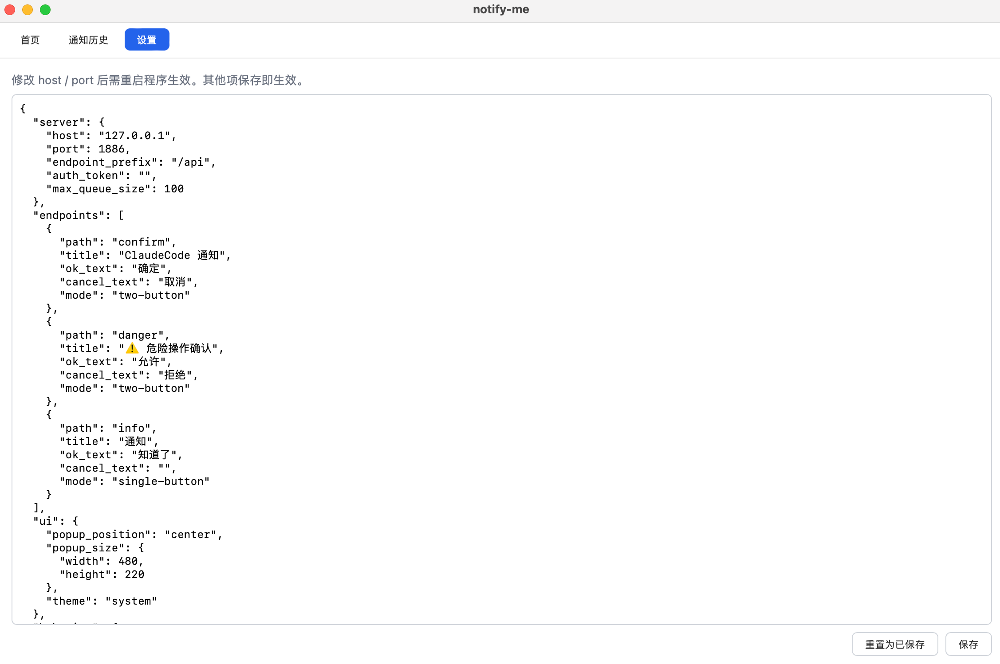

> **注意：** 修改 `host` 或 `port` 后需要重启程序才能生效，其他配置项保存后立即生效。

---

## 系统托盘

应用运行后在系统托盘显示图标，提供以下菜单选项：

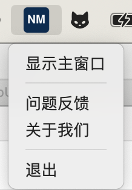

| 菜单项 | 功能 |
| --- | --- |
| 显示主窗口 | 打开/激活主界面 |
| 问题反馈 | 打开可以直接进行问题反馈填写页面 |
| 关于我们 | 打开后查看关注我们页面信息 |
| 退出 | 优雅关停：关闭 HTTP 服务、取消排队请求、关闭数据库 |

**关闭主窗口不会退出应用**，而是最小化到系统托盘。要完全退出，请通过托盘菜单的「退出」选项。

---

## 配置详解

配置文件路径见 [文件位置](#文件位置)。

```json
{
  "server": {
    "host": "127.0.0.1",
    "port": 1886,
    "endpoint_prefix": "/api",
    "auth_token": "",
    "max_queue_size": 100
  },
  "endpoints": [
    {
      "path": "confirm",
      "title": "ClaudeCode 通知",
      "ok_text": "确定",
      "cancel_text": "取消",
      "mode": "two-button"
    },
    {
      "path": "danger",
      "title": "⚠️ 危险操作确认",
      "ok_text": "允许",
      "cancel_text": "拒绝",
      "mode": "two-button"
    },
    {
      "path": "info",
      "title": "通知",
      "ok_text": "知道了",
      "cancel_text": "",
      "mode": "single-button"
    }
  ],
  "ui": {
    "popup_position": "center",
    "popup_size": { "width": 480, "height": 220 },
    "theme": "system"
  },
  "behavior": {
    "default_timeout_seconds": 180,
    "timeout_action": "timeout",
    "sound_enabled": true,
    "blink_enabled": true,
    "stop_hook_enabled": true,
    "autostart": false,
    "minimize_to_tray_on_close": true
  },
  "history": {
    "max_records": 1000,
    "retention_days": 30
  },
  "log": {
    "level": "info",
    "max_size_mb": 5,
    "max_backups": 3
  }
}
```

### 配置项说明

| 配置项 | 默认值 | 说明 | 是否热更新 |
| --- | --- | --- | --- |
| `server.host` | `127.0.0.1` | 监听地址 | 需重启 |
| `server.port` | `1886` | 监听端口 | 需重启 |
| `server.endpoint_prefix` | `/api` | API 路径前缀 | 需重启 |
| `server.auth_token` | `""` | 鉴权 Token，为空则不鉴权 | 需重启 |
| `server.max_queue_size` | `100` | 最大待处理队列长度 | 是 |
| `endpoints` | 三个默认端点 | 自定义 API 端点 | 需重启 |
| `ui.popup_position` | `center` | 弹窗位置：`center` / `cursor` / `bottom-right` | 是 |
| `ui.popup_size` | `480x220` | 弹窗尺寸 | 是 |
| `ui.theme` | `system` | 主题：`system` / `light` / `dark` | 是 |
| `behavior.default_timeout_seconds` | `180` | 默认超时（秒） | 是 |
| `behavior.timeout_action` | `timeout` | 超时返回值：`timeout` 或 `denied` | 是 |
| `behavior.sound_enabled` | `true` | 通知音效 | 是 |
| `behavior.blink_enabled` | `true` | 图标闪动 | 是 |
| `behavior.autostart` | `false` | 开机自启 | 是 |
| `behavior.minimize_to_tray_on_close` | `true` | 关闭窗口时最小化到托盘 | 是 |
| `history.max_records` | `1000` | 最大历史记录数 | 是 |
| `history.retention_days` | `30` | 历史记录保留天数 | 是 |
| `log.level` | `info` | 日志级别：`info` / `debug` | 是 |

---

## 安全说明

- **默认仅监听 `127.0.0.1`**，不暴露到公网
- **可选 Token 鉴权**：设置 `auth_token` 后，请求必须携带 `X-Token` Header，否则返回 401
- **请求体大小限制**：最大 64 KB
- **不记录请求 body**（隐私保护）

---

## 常见问题

### macOS 提示「无法打开，因为它来自身份不明的开发者」

右键点击应用 → 选择「打开」→ 在弹出对话框中再次点击「打开」。这是 macOS Gatekeeper 对未签名应用的保护机制，只需操作一次。

### 端口被占用

修改 `config.json` 中的 `server.port`，然后重启应用。

### 启动后没有窗口出现

应用启动后以系统托盘方式运行，点击托盘图标 → 「显示主窗口」即可打开。

### 第二次启动没有效果

Notify Me 是单实例应用。如果已经有一个实例在运行，再次启动会激活已有实例的主窗口，然后自动退出。

### Claude Code 的 Hook 没有生效

1. 确认 Notify Me 正在运行（检查托盘图标）
2. 在首页检查 Hook 配置状态
3. 如果环境变量未配置，点击「一键配置」
4. 尝试使用 HTTP 模式代替 stdio 模式

### 弹窗没有置顶

- **macOS：** 检查系统设置 → 隐私与安全 → 辅助功能，确保 Notify Me 有权限
- **Windows：** 正常情况下会自动置顶，如果被其他全屏应用覆盖，可以尝试 Alt+Tab 切换

---

## 文件位置

### 应用数据

| 平台 | 路径 |
| --- | --- |
| macOS | `~/.notice-me/` |
| Windows | `%APPDATA%\notify-me\` |

### 数据文件

| 文件 | 说明 |
| --- | --- |
| `config.json` | 配置文件 |
| `notifications.db` | SQLite 通知历史数据库 |
| `.lock` | 单实例文件锁 |
| `logs/notify-me.log` | 日志文件 |

### Claude Code 配置

| 范围 | 路径 |
| --- | --- |
| 全局配置 | `~/.claude/settings.json` |
| 项目配置 | `.claude/settings.json` |

---

## 许可证

MIT License
